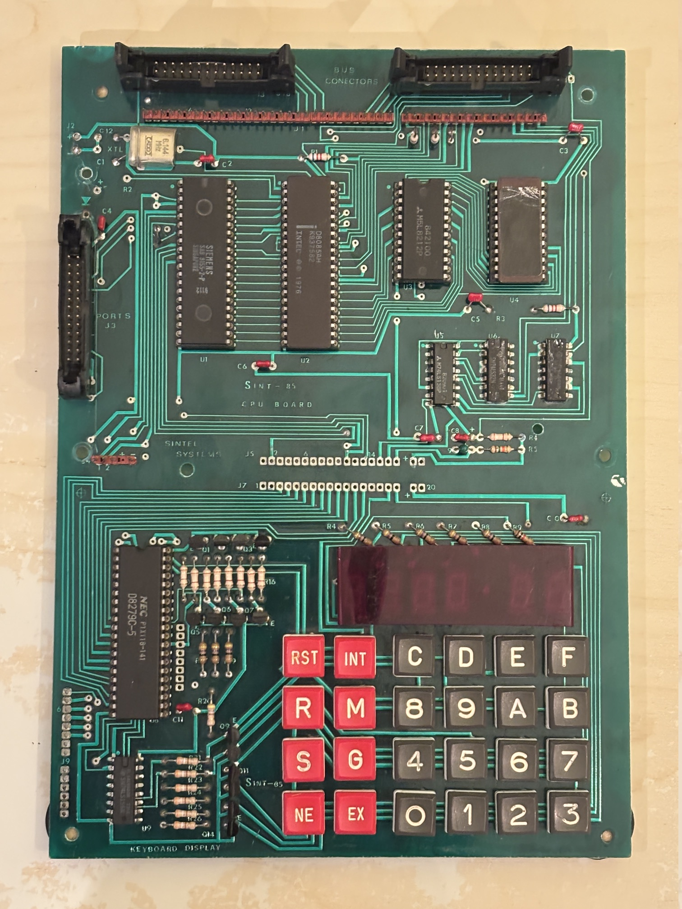

# Sintel Systems SINT-85, 8085 SBC

Seems to be a derivative of the Intel SDK85 lab systems. This system is a reduced size and functionality for which I did not find any match in web searches so I am documenting it here.



## Schematics

Uses similar address decoding logic to Intel SDK85 with some changes and different edge connectors. The IC set include:
- U1 8156 (or 8155 with a chip select level hack)
- U2 Intel 8085AH with a 6.144MHz crystal
- U3 8212 address latch
- U4 EPROM 2716
- U5 74LS138
- U6 74LS32
- U7 74LS00
- U8 8279 7-segment display and keyboard controller
- U9 74LS156

## EPROM 2716 read using EEPROM 28C256 programmer

```
    2716      28C256        2716
    ----    -----------     ----
            A14     Vcc
            A12     ^WE
1   A7      A7      A13     Vcc <-- isolate and jump to Vcc
2   A6      A6      A8      A8
3   A5      A5      A9      A9
4   A4      A5      A11     Vpp
5   A3      A3      ^OE     ^OE
6   A2      A2      A10     A10
7   A1      A1      ^CE     ^CE
8   A0      A0      D7      D7
9   D0      D0      D6      D6
10  D1      D1      D5      D5
11  D2      D2      D4      D4
12  GNG     GND     D3      D3
```

Address range read: $F800 to $FFFF

````
15 14 13 12 11 10  9  8  7  6  5  4  3  2  1  0
 x  x  1  x  1  x  x  x  x  x  x  x  x  x  x  x
----------- ----------- ----------- -----------
     7           8            0          0
     7           F            F          F
```


